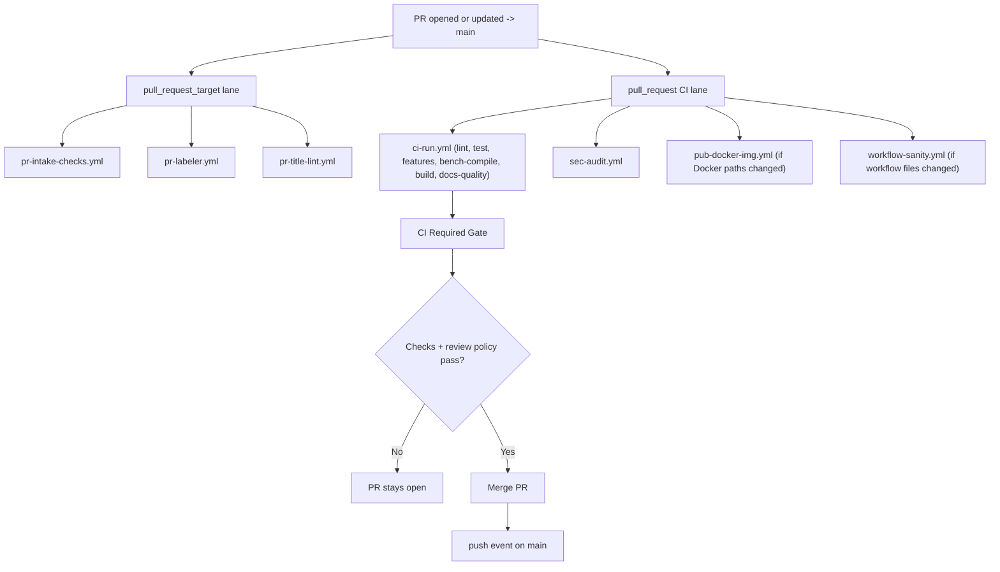
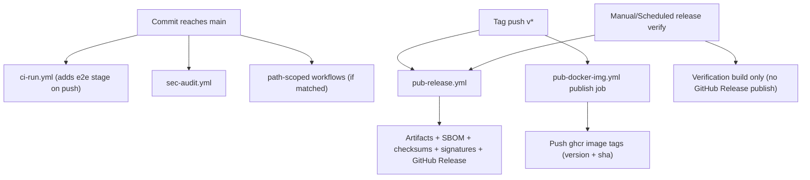

# Main Branch Delivery Flows

This document explains what runs when code is proposed to `main`, merged into `main`, and released.

Use this with:

- [`docs/ci-map.md`](../../docs/ci-map.md)
- [`docs/pr-workflow.md`](../../docs/pr-workflow.md)
- [`docs/release-process.md`](../../docs/release-process.md)

## Event Summary

| Event | Main workflows |
| --- | --- |
| PR activity (`pull_request_target`) | `pr-intake-checks.yml`, `pr-labeler.yml`, `pr-title-lint.yml` |
| PR activity (`pull_request`) | `ci-run.yml`, `sec-audit.yml`, plus path-scoped `pub-docker-img.yml`, `workflow-sanity.yml` |
| Push to `main` | `ci-run.yml`, `sec-audit.yml`, plus path-scoped workflows |
| Tag push (`v*`) | `pub-release.yml` publish mode, `pub-docker-img.yml` publish job |
| Scheduled/manual | `pub-release.yml` verification mode, `sec-codeql.yml`, `sec-audit.yml`, `test-fuzz.yml` |

## Step-By-Step

### 1) PR -> `main`

1. Contributor opens or updates a PR against `main`.
2. `pull_request_target` automation runs:
   - `pr-intake-checks.yml` posts intake warnings/errors.
   - `pr-labeler.yml` sets size/risk/scope labels.
   - `pr-title-lint.yml` validates the Conventional Commits PR title.
3. `pull_request` CI workflows start:
   - `ci-run.yml` (consolidated Rust quality gate)
   - `sec-audit.yml`
   - path-scoped workflows if matching files changed:
     - `pub-docker-img.yml` (Docker build-input paths only)
     - `workflow-sanity.yml` (workflow files only)
4. In `ci-run.yml`, `changes` computes:
   - `docs_only`
   - `docs_changed`
   - `rust_changed`
5. Rust path stages:
   - `lint` — fmt + clippy + strict delta clippy on changed lines.
   - `test` — `cargo nextest run --locked --workspace` (PR: only with `ci:full`).
   - `features` — matrix `cargo check` over `no-default-features` / `all-features` / `hardware` / `browser-native` (PR: only with `ci:full`).
   - `bench-compile` — `cargo bench --no-run --locked` (PR: only with `ci:full`).
   - `e2e` — push-to-`main` only; never runs on PRs.
   - `build` — release-fast smoke + binary-size guard (always runs for rust changes).
6. Docs path: `docs-quality` runs incremental markdownlint + lychee on added links.
7. `lint-feedback` posts an actionable failure comment if lint/docs gates fail on a PR.
8. `CI Required Gate` aggregates results to final pass/fail.
9. Maintainer merges PR once checks and review policy are satisfied.
10. Merge emits a `push` event on `main` (see scenario 2).

### 2) Push to `main` (including after merge)

1. Commit reaches `main`.
2. `ci-run.yml` runs on `push` — all rust stages run unconditionally (no `ci:full` requirement).
3. `sec-audit.yml` runs on `push` (Cargo paths).
4. Path-filtered workflows run only if touched files match their filters.
5. `CI Required Gate` computes overall push result.

### 3) Fork PR specifics

1. `pull_request_target` workflows run with base-repo context and base-repo token; `pull_request` workflows use a restricted token, so secret-needing steps may be limited.
2. If Actions settings require maintainer approval for fork workflows, the `pull_request` run stays in `action_required`/waiting state until approved.
3. Otherwise the rust stage rules above are identical.

## Docker Publish Logic

Workflow: `.github/workflows/pub-docker-img.yml`.

- PR: `pr-smoke` job builds + `docker run ... --version` smoke; no registry push.
- Push to `main` (build-input paths) + tag `v*` + manual dispatch: `publish` job builds multi-arch (`linux/amd64,linux/arm64`) and pushes to `ghcr.io/<owner>/<repo>`. Tag computation: `latest` + `sha-<12>` for `main`, `vX.Y.Z` + `sha-<12>` for tags.

## Release Logic

Workflow: `.github/workflows/pub-release.yml`.

1. Triggers:
   - Tag push `v*` -> publish mode.
   - Manual dispatch -> verification-only or publish mode (input-driven).
   - Weekly schedule -> verification-only mode.
2. `prepare` resolves release context and validates manual publish inputs.
3. `build-release` builds matrix artifacts across Linux/macOS/Windows.
4. `verify-artifacts` enforces presence of all expected archives.
5. In publish mode: SBOM (CycloneDX + SPDX), `SHA256SUMS`, keyless cosign signatures, GHCR release-tag check.
6. In publish mode: creates/updates the GitHub Release.

## Merge/Policy Notes

1. Branch protection should require only `CI Required Gate` — internal stages can change without touching protection settings.
2. PR strictness for heavy stages (`test`, `features`, `bench-compile`, `docs-quality`) is controlled by the `ci:full` label. `build` always runs for rust changes; `e2e` is push-only.
3. `sec-audit.yml` runs on both PR and push, plus scheduled weekly.
4. Workflow-file changes are linted by `workflow-sanity.yml` (`actionlint`, tab check); no maintainer-approval gate.
5. Workflow-specific JavaScript helpers are organized under `.github/workflows/scripts/`.

## Mermaid Diagrams

### PR to Main

### Push/Tag Delivery

## Quick Troubleshooting

1. Unexpected skipped jobs: inspect `scripts/ci/detect_change_scope.sh` outputs and confirm whether `ci:full` is required for the stage that failed.
2. Fork PR appears stalled: check whether Actions run approval is pending.
3. Docker not published: confirm changed files match Docker build-input paths, or run workflow dispatch manually.
4. PR title check failing: ensure title matches Conventional Commits (`feat|fix|chore|docs|refactor|perf|test|build|ci|style|revert`, optional scope, colon, summary).
5. `bench-compile` failing but tests passing: a criterion target compiles only with `--no-run`; check `benches/agent_benchmarks.rs` for new deps that need `dev-dependencies`.
