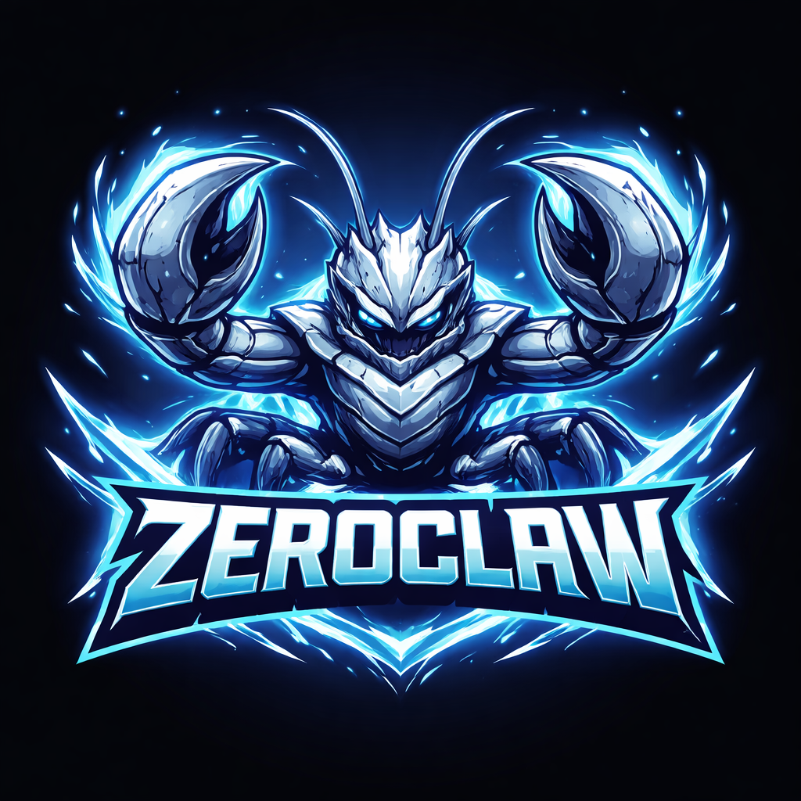

<p align="center">
  
</p>

<h1 align="center">RantaiClaw 🦀（日本語）</h1>

<p align="center">
  <strong>Zero overhead. Zero compromise. 100% Rust. 100% Agnostic.</strong>
</p>

<p align="center">
  <a href="https://x.com/rantaiclawlabs?s=21"></a>
  <a href="https://www.xiaohongshu.com/user/profile/67cbfc43000000000d008307?xsec_token=AB73VnYnGNx5y36EtnnZfGmAmS-6Wzv8WMuGpfwfkg6Yc%3D&xsec_source=pc_search"></a>
  <a href="https://t.me/rantaiclawlabs"></a>
  <a href="https://t.me/rantaiclawlabs_cn"></a>
  <a href="https://t.me/rantaiclawlabs_ru"></a>
  <a href="https://www.reddit.com/r/rantaiclawlabs/"></a>
</p>

<p align="center">
  🌐 言語: <a href="README.md">English</a> · <a href="README.zh-CN.md">简体中文</a> · <a href="README.ja.md">日本語</a> · <a href="README.ru.md">Русский</a> · <a href="README.fr.md">Français</a> · <a href="README.vi.md">Tiếng Việt</a>
</p>

<p align="center">
  <a href="bootstrap.sh">ワンクリック導入</a> |
  <a href="docs/getting-started/README.md">導入ガイド</a> |
  <a href="docs/README.ja.md">ドキュメントハブ</a> |
  <a href="docs/SUMMARY.md">Docs TOC</a>
</p>

<p align="center">
  <strong>クイック分流：</strong>
  <a href="docs/reference/README.md">参照</a> ·
  <a href="docs/operations/README.md">運用</a> ·
  <a href="docs/troubleshooting.md">障害対応</a> ·
  <a href="docs/security/README.md">セキュリティ</a> ·
  <a href="docs/hardware/README.md">ハードウェア</a> ·
  <a href="docs/contributing/README.md">貢献・CI</a>
</p>

> この文書は `README.md` の内容を、正確性と可読性を重視して日本語に整えた版です（逐語訳ではありません）。
>
> コマンド名、設定キー、API パス、Trait 名などの技術識別子は英語のまま維持しています。
>
> 最終同期日: **2026-02-19**。

## 📢 お知らせボード

重要なお知らせ（互換性破壊変更、セキュリティ告知、メンテナンス時間、リリース阻害事項など）をここに掲載します。

| 日付 (UTC) | レベル | お知らせ | 対応 |
|---|---|---|---|
| 2026-02-19 | _緊急_ | 私たちは `openagen/rantaiclaw` および `rantaiclaw.org` とは**一切関係ありません**。`rantaiclaw.org` は現在 `openagen/rantaiclaw` の fork を指しており、そのドメイン/リポジトリは当プロジェクトの公式サイト・公式プロジェクトを装っています。 | これらの情報源による案内、バイナリ、資金調達情報、公式発表は信頼しないでください。必ず本リポジトリと認証済み公式SNSのみを参照してください。 |
| 2026-02-19 | _重要_ | 公式サイトは**まだ公開しておらず**、なりすましの試みを確認しています。RantaiClaw 名義の投資・資金調達などの活動には参加しないでください。 | 情報は本リポジトリを最優先で確認し、[X（@rantaiclawlabs）](https://x.com/rantaiclawlabs?s=21)、[Reddit（r/rantaiclawlabs）](https://www.reddit.com/r/rantaiclawlabs/)、[Telegram（@rantaiclawlabs）](https://t.me/rantaiclawlabs)、[Telegram CN（@rantaiclawlabs_cn）](https://t.me/rantaiclawlabs_cn)、[Telegram RU（@rantaiclawlabs_ru）](https://t.me/rantaiclawlabs_ru) と [小紅書アカウント](https://www.xiaohongshu.com/user/profile/67cbfc43000000000d008307?xsec_token=AB73VnYnGNx5y36EtnnZfGmAmS-6Wzv8WMuGpfwfkg6Yc%3D&xsec_source=pc_search) で公式更新を確認してください。 |
| 2026-02-19 | _重要_ | Anthropic は 2026-02-19 に Authentication and Credential Use を更新しました。条文では、OAuth authentication（Free/Pro/Max）は Claude Code と Claude.ai 専用であり、Claude Free/Pro/Max で取得した OAuth トークンを他の製品・ツール・サービス（Agent SDK を含む）で使用することは許可されず、Consumer Terms of Service 違反に該当すると明記されています。 | 損失回避のため、当面は Claude Code OAuth 連携を試さないでください。原文: [Authentication and Credential Use](https://code.claude.com/docs/en/legal-and-compliance#authentication-and-credential-use)。 |

## 概要

RantaiClaw は、高速・省リソース・高拡張性を重視した自律エージェント実行基盤です。

- Rust ネイティブ実装、単一バイナリで配布可能
- Trait ベース設計（`Provider` / `Channel` / `Tool` / `Memory` など）
- セキュアデフォルト（ペアリング、明示 allowlist、サンドボックス、スコープ制御）

## RantaiClaw が選ばれる理由

- **軽量ランタイムを標準化**: CLI や `status` などの常用操作は数MB級メモリで動作。
- **低コスト環境に適合**: 低価格ボードや小規模クラウドでも、重い実行基盤なしで運用可能。
- **高速コールドスタート**: Rust 単一バイナリにより、主要コマンドと daemon 起動が非常に速い。
- **高い移植性**: ARM / x86 / RISC-V を同じ運用モデルで扱え、provider/channel/tool を差し替え可能。

## ベンチマークスナップショット（RantaiClaw vs OpenClaw、再現可能）

以下はローカルのクイック比較（macOS arm64、2026年2月）を、0.8GHz エッジ CPU 基準で正規化したものです。

| | OpenClaw | NanoBot | PicoClaw | RantaiClaw 🦀 |
|---|---|---|---|---|
| **言語** | TypeScript | Python | Go | **Rust** |
| **RAM** | > 1GB | > 100MB | < 10MB | **< 5MB** |
| **起動時間（0.8GHz コア）** | > 500s | > 30s | < 1s | **< 10ms** |
| **バイナリサイズ** | ~28MB（dist） | N/A（スクリプト） | ~8MB | **~8.8 MB** |
| **コスト** | Mac Mini $599 | Linux SBC ~$50 | Linux ボード $10 | **任意の $10 ハードウェア** |

> 注記: RantaiClaw の結果は release ビルドを `/usr/bin/time -l` で計測したものです。OpenClaw は Node.js ランタイムが必要で、ランタイム由来だけで通常は約390MBの追加メモリを要します。NanoBot は Python ランタイムが必要です。PicoClaw と RantaiClaw は静的バイナリです。

<p align="center">
  
</p>

### ローカルで再現可能な測定

ベンチマーク値はコードやツールチェーン更新で変わるため、必ず自身の環境で再測定してください。

```bash
cargo build --release
ls -lh target/release/rantaiclaw

/usr/bin/time -l target/release/rantaiclaw --help
/usr/bin/time -l target/release/rantaiclaw status
```

README のサンプル値（macOS arm64, 2026-02-18）:

- Release バイナリ: `8.8M`
- `rantaiclaw --help`: 約 `0.02s`、ピークメモリ 約 `3.9MB`
- `rantaiclaw status`: 約 `0.01s`、ピークメモリ 約 `4.1MB`

## ワンクリック導入

```bash
git clone https://github.com/rantaiclaw-labs/rantaiclaw.git
cd rantaiclaw
./bootstrap.sh
```

環境ごと初期化する場合: `./bootstrap.sh --install-system-deps --install-rust`（システムパッケージで `sudo` が必要な場合があります）。

詳細は [`docs/one-click-bootstrap.md`](docs/one-click-bootstrap.md) を参照してください。

## クイックスタート

### Homebrew（macOS/Linuxbrew）

```bash
brew install rantaiclaw
```

```bash
git clone https://github.com/rantaiclaw-labs/rantaiclaw.git
cd rantaiclaw
cargo build --release --locked
cargo install --path . --force --locked

rantaiclaw onboard --api-key sk-... --provider openrouter
rantaiclaw onboard --interactive

rantaiclaw agent -m "Hello, RantaiClaw!"

# default: 127.0.0.1:3000
rantaiclaw gateway

rantaiclaw daemon
```

## Subscription Auth（OpenAI Codex / Claude Code）

RantaiClaw はサブスクリプションベースのネイティブ認証プロファイルをサポートしています（マルチアカウント対応、保存時暗号化）。

- 保存先: `~/.rantaiclaw/auth-profiles.json`
- 暗号化キー: `~/.rantaiclaw/.secret_key`
- Profile ID 形式: `<provider>:<profile_name>`（例: `openai-codex:work`）

OpenAI Codex OAuth（ChatGPT サブスクリプション）:

```bash
# サーバー/ヘッドレス環境向け推奨
rantaiclaw auth login --provider openai-codex --device-code

# ブラウザ/コールバックフロー（ペーストフォールバック付き）
rantaiclaw auth login --provider openai-codex --profile default
rantaiclaw auth paste-redirect --provider openai-codex --profile default

# 確認 / リフレッシュ / プロファイル切替
rantaiclaw auth status
rantaiclaw auth refresh --provider openai-codex --profile default
rantaiclaw auth use --provider openai-codex --profile work
```

Claude Code / Anthropic setup-token:

```bash
# サブスクリプション/setup token の貼り付け（Authorization header モード）
rantaiclaw auth paste-token --provider anthropic --profile default --auth-kind authorization

# エイリアスコマンド
rantaiclaw auth setup-token --provider anthropic --profile default
```

Subscription auth で agent を実行:

```bash
rantaiclaw agent --provider openai-codex -m "hello"
rantaiclaw agent --provider openai-codex --auth-profile openai-codex:work -m "hello"

# Anthropic は API key と auth token の両方の環境変数をサポート:
# ANTHROPIC_AUTH_TOKEN, ANTHROPIC_OAUTH_TOKEN, ANTHROPIC_API_KEY
rantaiclaw agent --provider anthropic -m "hello"
```

## アーキテクチャ

すべてのサブシステムは **Trait** — 設定変更だけで実装を差し替え可能、コード変更不要。

<p align="center">
  
</p>

| サブシステム | Trait | 内蔵実装 | 拡張方法 |
|-------------|-------|----------|----------|
| **AI モデル** | `Provider` | `rantaiclaw providers` で確認（現在 28 個の組み込み + エイリアス、カスタムエンドポイント対応） | `custom:https://your-api.com`（OpenAI 互換）または `anthropic-custom:https://your-api.com` |
| **チャネル** | `Channel` | CLI, Telegram, Discord, Slack, Mattermost, iMessage, Matrix, Signal, WhatsApp, Email, IRC, Lark, DingTalk, QQ, Webhook | 任意のメッセージ API |
| **メモリ** | `Memory` | SQLite ハイブリッド検索, PostgreSQL バックエンド, Lucid ブリッジ, Markdown ファイル, 明示的 `none` バックエンド, スナップショット/復元, オプション応答キャッシュ | 任意の永続化バックエンド |
| **ツール** | `Tool` | shell/file/memory, cron/schedule, git, pushover, browser, http_request, screenshot/image_info, composio (opt-in), delegate, ハードウェアツール | 任意の機能 |
| **オブザーバビリティ** | `Observer` | Noop, Log, Multi | Prometheus, OTel |
| **ランタイム** | `RuntimeAdapter` | Native, Docker（サンドボックス） | adapter 経由で追加可能；未対応の kind は即座にエラー |
| **セキュリティ** | `SecurityPolicy` | Gateway ペアリング, サンドボックス, allowlist, レート制限, ファイルシステムスコープ, 暗号化シークレット | — |
| **アイデンティティ** | `IdentityConfig` | OpenClaw (markdown), AIEOS v1.1 (JSON) | 任意の ID フォーマット |
| **トンネル** | `Tunnel` | None, Cloudflare, Tailscale, ngrok, Custom | 任意のトンネルバイナリ |
| **ハートビート** | Engine | HEARTBEAT.md 定期タスク | — |
| **スキル** | Loader | TOML マニフェスト + SKILL.md インストラクション | コミュニティスキルパック |
| **インテグレーション** | Registry | 9 カテゴリ、70 件以上の連携 | プラグインシステム |

### ランタイムサポート（現状）

- ✅ 現在サポート: `runtime.kind = "native"` または `runtime.kind = "docker"`
- 🚧 計画中（未実装）: WASM / エッジランタイム

未対応の `runtime.kind` が設定された場合、RantaiClaw は native へのサイレントフォールバックではなく、明確なエラーで終了します。

### メモリシステム（フルスタック検索エンジン）

すべて自社実装、外部依存ゼロ — Pinecone、Elasticsearch、LangChain 不要:

| レイヤー | 実装 |
|---------|------|
| **ベクトル DB** | Embeddings を SQLite に BLOB として保存、コサイン類似度検索 |
| **キーワード検索** | FTS5 仮想テーブル、BM25 スコアリング |
| **ハイブリッドマージ** | カスタム重み付きマージ関数（`vector.rs`） |
| **Embeddings** | `EmbeddingProvider` trait — OpenAI、カスタム URL、または noop |
| **チャンキング** | 行ベースの Markdown チャンカー（見出し構造保持） |
| **キャッシュ** | SQLite `embedding_cache` テーブル、LRU エビクション |
| **安全な再インデックス** | FTS5 再構築 + 欠落ベクトルの再埋め込みをアトミックに実行 |

Agent はツール経由でメモリの呼び出し・保存・管理を自動的に行います。

```toml
[memory]
backend = "sqlite"             # "sqlite", "lucid", "postgres", "markdown", "none"
auto_save = true
embedding_provider = "none"    # "none", "openai", "custom:https://..."
vector_weight = 0.7
keyword_weight = 0.3
```

## セキュリティのデフォルト

- Gateway の既定バインド: `127.0.0.1:3000`
- 既定でペアリング必須: `require_pairing = true`
- 既定で公開バインド禁止: `allow_public_bind = false`
- Channel allowlist:
  - `[]` は deny-by-default
  - `["*"]` は allow all（意図的に使う場合のみ）

## 設定例

```toml
api_key = "sk-..."
default_provider = "openrouter"
default_model = "anthropic/claude-sonnet-4-6"
default_temperature = 0.7

[memory]
backend = "sqlite"
auto_save = true
embedding_provider = "none"

[gateway]
host = "127.0.0.1"
port = 3000
require_pairing = true
allow_public_bind = false
```

## ドキュメント入口

- ドキュメントハブ（英語）: [`docs/README.md`](docs/README.md)
- 統合 TOC: [`docs/SUMMARY.md`](docs/SUMMARY.md)
- ドキュメントハブ（日本語）: [`docs/README.ja.md`](docs/README.ja.md)
- コマンドリファレンス: [`docs/commands-reference.md`](docs/commands-reference.md)
- 設定リファレンス: [`docs/config-reference.md`](docs/config-reference.md)
- Provider リファレンス: [`docs/providers-reference.md`](docs/providers-reference.md)
- Channel リファレンス: [`docs/channels-reference.md`](docs/channels-reference.md)
- 運用ガイド（Runbook）: [`docs/operations-runbook.md`](docs/operations-runbook.md)
- トラブルシューティング: [`docs/troubleshooting.md`](docs/troubleshooting.md)
- ドキュメント一覧 / 分類: [`docs/docs-inventory.md`](docs/docs-inventory.md)
- プロジェクト triage スナップショット: [`docs/project-triage-snapshot-2026-02-18.md`](docs/project-triage-snapshot-2026-02-18.md)

## コントリビュート / ライセンス

- Contributing: [`CONTRIBUTING.md`](CONTRIBUTING.md)
- PR Workflow: [`docs/pr-workflow.md`](docs/pr-workflow.md)
- Reviewer Playbook: [`docs/reviewer-playbook.md`](docs/reviewer-playbook.md)
- License: MIT（[`LICENSE`](LICENSE), [`NOTICE`](NOTICE)）

---

詳細仕様（全コマンド、アーキテクチャ、API 仕様、開発フロー）は英語版の [`README.md`](README.md) を参照してください。
